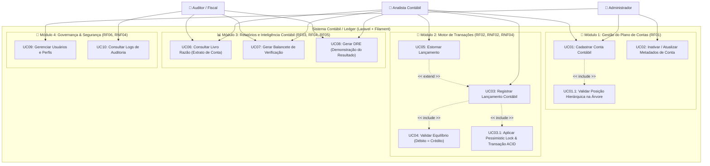
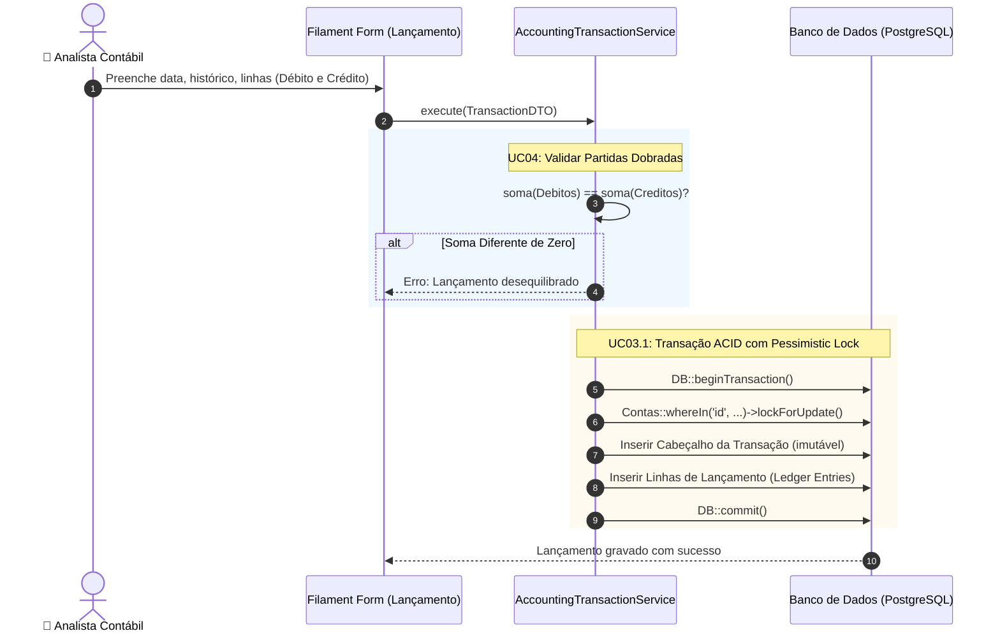
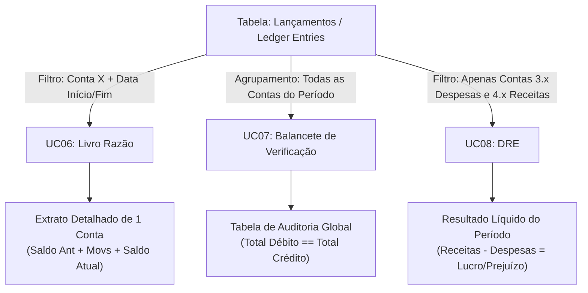

# 🗺️ Mapa de Casos de Uso & Arquitetura Funcional do Sistema Contábil

Este documento detalha o funcionamento, atores, relacionamentos e regras de negócio do sistema contábil baseado no [levantamento de requisitos](file:///home/mintojazz/Documents/projects/budget-tracker/docs/levantamento-requisitos.md).

---

## 1. Visão Geral & Conceitos-Chave

O sistema opera no modelo **Ledger (Livro-Razão Contábil)**. Diferente de um sistema financeiro comum (que apenas edita saldos num campo `balance`), um sistema contábil segue 3 pilares rigorosos:

> [!IMPORTANT]
> **Pilares Fundamentais do Sistema:**
> 1. **Método das Partidas Dobradas:** Não existe dinheiro que aparece do nada ou some. Toda movimentação envolve pelo menos duas contas (onde a soma dos Débitos = soma dos Créditos).
> 2. **Imutabilidade Absoluta:** Lançamentos contábeis processados nunca recebem `UPDATE` nem `DELETE`. Correções são feitas via **Estorno** (um novo lançamento de sinal oposto).
> 3. **Hierarquia em Árvore:** As contas são organizadas em níveis. Apenas contas-folha (**analíticas**) recebem lançamentos. Contas-mãe (**sintéticas**) apenas totalizam.

---

## 2. Atores do Sistema & Matriz de Acesso (RBAC)

| Ator | Descrição | Permissões |
| :--- | :--- | :--- |
| **👤 Administrador** | Responsável pela infraestrutura, parametrização e usuários. | Gestão de Usuários, Configuração do Plano de Contas, Acesso Irrestrito. |
| **👤 Analista Contábil** | Operador diário do sistema. | Registrar Lançamentos, Solicitar Estornos, Emitir Relatórios e Consultas. |
| **👤 Auditor / Fiscal** | Perfil consultivo e fiscalizador. | Acesso estritamente **Read-Only** (Livro Razão, Balancete, DRE, Logs de Auditoria). |

---

## 3. Diagrama Geral de Casos de Uso



---

## 4. Detalhamento dos Módulos e Casos de Uso

### 📁 Módulo 1: Plano de Contas (RF01)

O plano de contas é a espinha dorsal do sistema contábil. Ele segue uma estrutura padronizada:

```text
1. Ativo (Bens e Direitos) - Natureza Devedora
   ├── 1.1 Ativo Circulante (Disponibilidades imediatas)
   │   ├── 1.1.1 Caixa e Equivalentes de Caixa
   │   │   ├── 1.1.1.01 Banco Inter [Analítica]
   │   │   └── 1.1.1.02 Cofre Local [Analítica]
2. Passivo (Dívidas e Obrigações) - Natureza Credora
   ├── 2.1 Fornecedores a Pagar
   │   └── 2.1.1.01 Fornecedor Dell Computadores [Analítica]
3. Despesas (Gastos que reduzem patrimônio) - Natureza Devedora
   └── 3.1.1.01 Despesas com Equipamentos de TI [Analítica]
4. Receitas (Ganhos operacionais) - Natureza Credora
   └── 4.1.1.01 Receita de Prestação de Serviços [Analítica]
```

#### UC01: Cadastrar Conta Contábil
- **Ator Principal:** Analista Contábil / Administrador
- **Objetivo:** Inserir uma nova conta contábil mantendo a integridade da numeração.
- **Regras de Negócio:**
  1. Toda conta filha deve ter código derivado da conta pai (ex: filha de `1.1.1` deve ser `1.1.1.01`).
  2. Apenas contas marcadas como `analítica = true` podem receber transações no Módulo 2.
  3. Contas `sintéticas` servem exclusivamente como nós agregadores de saldo.

---

### 💸 Módulo 2: Motor de Lançamentos & Partidas Dobradas (RF02, RNF02, RNF04)



#### UC03: Registrar Lançamento Contábil
- **Ator Principal:** Analista Contábil
- **Pré-condições:** Usuário autenticado com permissão de escrita; contas analíticas cadastradas.
- **Fluxo Principal:**
  1. Informa Data da Operação, Número de Documento (opcional) e Histórico Geral.
  2. Adiciona as linhas da transação:
     - Conta Débito + Valor
     - Conta Crédito + Valor
  3. O sistema valida se `Total Débitos === Total Créditos` (**UC04**).
  4. O sistema persiste em lote dentro de uma transação atômica (`DB::transaction`).

#### UC05: Estornar Lançamento Contábil
- **Ator Principal:** Analista Contábil / Administrador
- **Motivação:** Como não existe `DELETE` ou `UPDATE` de lançamentos (RNF04), qualquer correção exige uma contra-operação.
- **Funcionamento:**
  - O sistema lê as linhas do lançamento original `L#100`.
  - Gera automaticamente um novo lançamento `L#101` com `tipo = 'estorno'`, `lancamento_origem_id = 100`.
  - Inverte as contas (o que era Débito vira Crédito e vice-versa).
  - O saldo líquido entre `L#100` e `L#101` passa a ser zero.

---

### 📊 Módulo 3: Consultas e Relatórios (RF03, RF04, RF05)



#### UC06: Consultar Livro Razão
- **Finalidade:** Visualizar a movimentação analítica de uma única conta contábil em um intervalo de datas.
- **Colunas exibidas:** `Data`, `Nº Lançamento`, `Histórico`, `Débito`, `Crédito`, `Saldo Acumulado`.

#### UC07: Gerar Balancete de Verificação
- **Finalidade:** Comprovar a exatidão matemática de toda a contabilidade.
- **Estrutura:**
  | Código | Nome da Conta | Saldo Anterior | Mov. Débito | Mov. Crédito | Saldo Atual |
  | :--- | :--- | :--- | :--- | :--- | :--- |
  | 1.1.1.01 | Banco Inter | R$ 10.000 (D) | R$ 2.000 | R$ 5.000 | R$ 7.000 (D) |
  | 2.1.1.01 | Fornecedores | R$ 0,00 | R$ 5.000 | R$ 5.000 | R$ 0,00 |
  | **TOTAL**| **Consolidado**| **-** | **R$ 7.000** | **R$ 7.000** | **-** |

#### UC08: Gerar DRE (Demonstração do Resultado do Exercício)
- **Finalidade:** Apurar o resultado econômico (Lucro ou Prejuízo) do negócio.
- **Fórmula de Consolidação:**
  $$\text{Resultado Líquido} = \sum (\text{Receitas - Grupo 4}) - \sum (\text{Despesas - Grupo 3})$$

---

## 5. Exemplo Prático Completo (Cenário Real)

> [!TIP]
> **Cenário:** A empresa comprou um Notebook de **R$ 4.000,00** à vista via transferência bancária do Banco Inter.

### 1. Como o Lançamento é registrado (UC03):
- **Data:** 07/08/2026
- **Histórico:** *Aquisição de notebook Dell Inspiron p/ setor de desenvolvimento*
- **Linha 1 (Débito):** Conta `3.1.1.01 (Despesas com TI)` $\rightarrow$ **R$ 4.000,00** *(Aumenta a despesa)*
- **Linha 2 (Crédito):** Conta `1.1.1.01 (Banco Inter)` $\rightarrow$ **R$ 4.000,00** *(Reduz o saldo bancário)*
- **Validação (UC04):** Débitos (4.000) - Créditos (4.000) = **0,00** ✅

### 2. Impacto nos Relatórios:
- **No Livro Razão do Banco Inter (UC06):** Aparece uma saída (crédito) de R$ 4.000,00 reduzindo o saldo disponível.
- **No Balancete de Verificação (UC07):** A coluna Débito soma +4.000 e a coluna Crédito soma +4.000 (equilíbrio mantido).
- **Na DRE (UC08):** A linha de "Despesas com TI" sobe R$ 4.000,00, diminuindo o Lucro Líquido final da empresa.

---

## 6. Dicas para a Defesa do TCC / Graduação em ADS

1. **Por que usar Service Classes em vez de lógica no Filament?**
   - *"Para garantir a separação de responsabilidades e permitir testes unitários e de integração automatizados (via Pest) que testam o motor contábil independentemente da interface gráfica."*
2. **Como foi garantida a integridade contra concorrência?**
   - *"Utilizando transações ACID do PostgreSQL (`DB::transaction`) associadas a `lockForUpdate()` (Pessimistic Locking) no Eloquent para impedir que duas requisições simultâneas corrompam o saldo."*
3. **Por que não existe `DELETE` na tabela de transações?**
   - *"Por exigência das normas de conformidade contábil e auditoria (Audit Trail). Erros são tratados exclusivamente por lançamentos compensatórios de estorno."*
